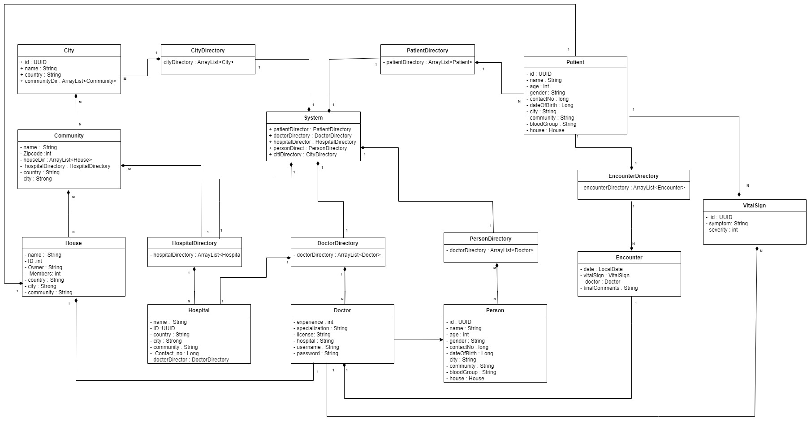
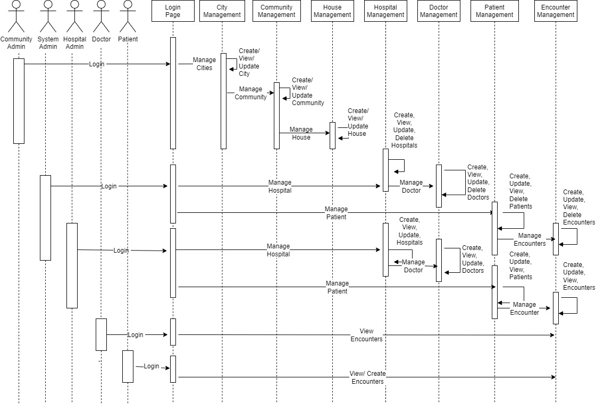

# Hospital Management

Name : Preksha Yadav

NEUID : 

### Overview : 

Hospital management system is used to manage various hospitals in different cities and communities. Can be used by patient for booking appointment based on the location they live in, also used by doctors for to track their patients and their managing their medical history.

### Class Diagram :

### Functionality:
1. Community Admin can add cities, communitites and houses.
2. System Admin can add, view, update and delete hospitals within the communities, doctors within the hospitals and  patients. Can also create encounters that is the appointments for a patient.

3. Hospital Admin can add, view and update hospitals within the communities, doctors within the hospitals.

4. Doctors can view all the appointments with different patients and also see the vital signs and accordingly update the encounters with the medications.

5. Patients can view their appointment history with different doctrs, book an appointment based on the city, community he will get list of doctors and hospitals and also view and update their personal details.

### Sequense Diagram :

### Steps to be performed
1. Clone the repo : https://github.com/PrekshaYadav/Employee_Management/tree/hospitalManagement 

    Branch : Assignment2

2. Open the project in netbeans/eclipse.
3. Click on build project, wait for build successful.
4. Run the project.
5. To access system admin dashboard, use username "sysadmin" and password as "sysadmin".
6. To access community admin dashboard, use username "cmadmin" and password as "cmadmin".
7. To access hospital admin dashboard, use username "hspadmin" and password as "hspadmin".

